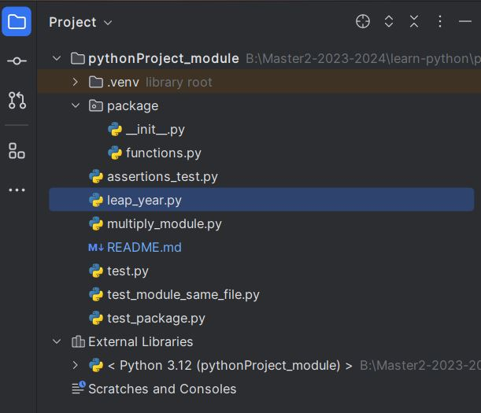

# Python fundamentals for Beginners

Learn basics concepts and syntaxes in Python

How to create functions.

How to create modules and their interests.

How to create packages and their interests.

How to manipulate exceptions add assertions.

## Documentation

[Documentation](https://docs.python.org/release/3.12.2/tutorial/index.html)

## 🚀 About Me
I'm an Accross Plateforms Archictecturer, an Engineer and Trainer. I'm also passionnate with DevOPs and Cloud Services.

## 🛠 Skills
Javascript, HTML, CSS,java,Javascript,Typescript,Python,PHP,DOT.NET...

@Accross plateforms trainer
My contacts: 00221 77 862 72 72 | bonevybeby@gmail.com

